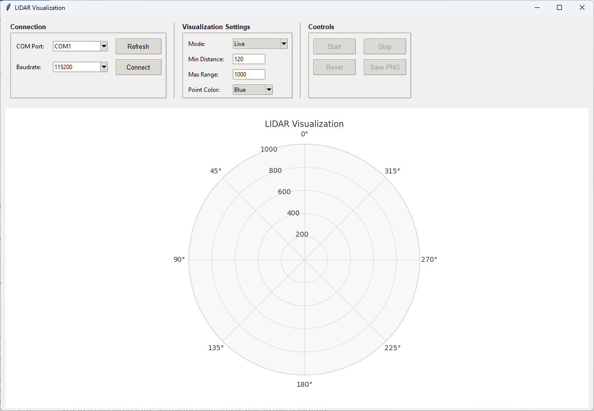

# LiDAR Visualization

Visualization tool for LiDAR sensor data.

## Features

- **Visualization** in a polar plot
- **Two visualizations modes**
    - **Real-time LiDAR data visualization** shows only the current scan data and refreshes completely with each update
    - **Long-exposure mode** accumulates points over time and creates more accurate images reducing noise
- **Fully configurable** through an GUI
- **Data export** with PNG saving capability

## Setup

1. Install the required packages:
```
pip install -r requirements.txt
```

2. Run the application:
```
python main.py
``` 

This will open the GUI where you can configure the visualization settings and see the LiDAR points on the polar plot.

## GUI



## Demo with robot


---

Go back to the main project [README](../README.md) for other details.