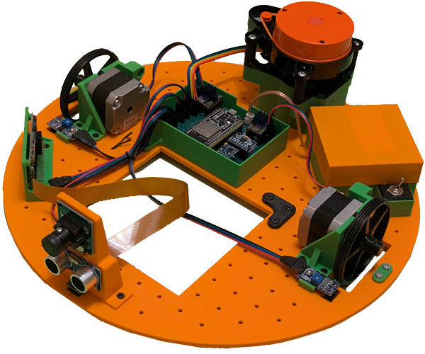

> [!CAUTION]
> This README is still work in progress

# Universal Robotic Platform

## Description

###  PL
Projekt na przedmioty *Projektowanie Systemów Cybernetyczno-Fizycznych* oraz *Uniwersalne Metody Projektowania Aplikacji na Urządzenia Mobilne i Wbudowane* w ramach 6. semestru studiów kierunku Informatyka na wydziale Automatyki, Elektroniki i Informatyki **Politechniki Śląskiej**.

### EN
Project for two courses during the 6th semester of the Informatics major on the **Silesian University of Technology's** Faculty of Automatic Control, Electronics and Computer Science.

---

## Goals

---

## Results

---

## Features

- beep
- boop

---

## Technologies involved

The project uses the following technologies:

- **C++** - for programming the ESP32 microcontrollers
- [**PlatformIO**](https://github.com/platformio) - build system for the microcontrollers with the [Arduino](https://github.com/arduino) framework
- **Flutter and Dart** - for creating the cross-platform GUI application,
- **Python** - for lidar data visualization as well as hosting the "base station" server

---

## Authors

- [Karol Orszulik](https://github.com/KarolOrszulik)
- [Karol Gryc](https://github.com/KarolGryc)
- [Krzysztof Witek](https://github.com/krzsztfwtk)

---

## License

This project is licensed under GNU General Public License v3.0. See [LICENSE](LICENSE) for details.
