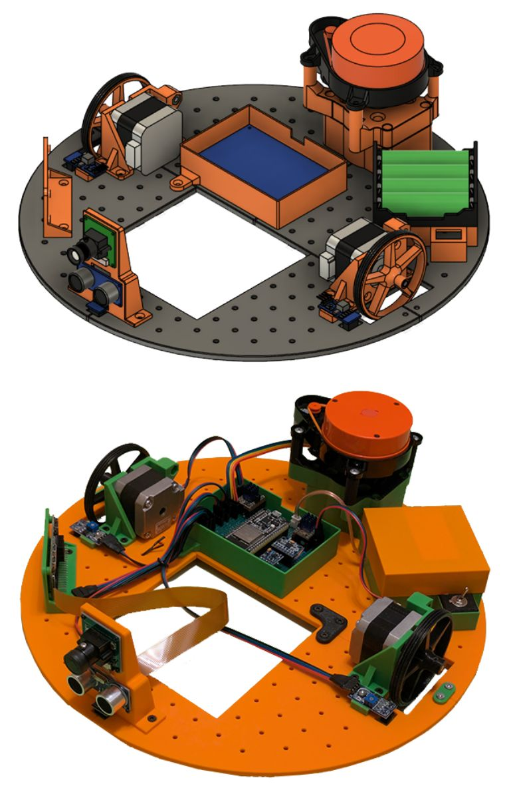

# Universal Robotic Platform

## Description

###  PL
Projekt na przedmioty *Projektowanie Systemów Cybernetyczno-Fizycznych* oraz *Uniwersalne Metody Projektowania Aplikacji na Urządzenia Mobilne i Wbudowane* w ramach 6. semestru studiów kierunku Informatyka na wydziale Automatyki, Elektroniki i Informatyki **Politechniki Śląskiej**.

### EN
Project for two courses during the 6th semester of the Informatics major on the **Silesian University of Technology's** Faculty of Automatic Control, Electronics and Computer Science.

---

## Goals

The focus of this project is to design and build a modular AGV (Automated Guided Vehicle) platform that can carry out various tasks indoors, depending on the installed functional module. Key objectives include:

- Creating a robotic base with a defined mounting area for interchangeable modules (e.g., vacuum cleaner, surface scanner, service robot).
- Enabling in-place rotation around the geometric center without changing the occupied footprint ("round chassis").
- Achieving precise positioning:
  - Linear accuracy ≤ ±10 cm in each axis
  - Orientation accuracy ≤ ±3°
- Obstacle detection and distance measurement:
  - Range of 10–60 cm
  - Measurement precision ≤ 1 cm
- Mapping and positioning with LiDAR
- Safe ground-edge detection (e.g., to avoid falling stairs) around the wheels. 
- Maximum forward speed up to 0.8 m/s and a full rotation in ≤ 3 s.
- A fully modular mechanical design for easy replacement of all components.

---

## Project Structure

The project is organized into several modules, each serving a specific purpose:

- [**ESP-Robot**](ESP-Robot/)  
  PlatformIO project for the ESP32 robot and base station controller.

- [**LIDAR-Vis**](LIDAR-Vis/)  
  Python-based visualization tool for rendering LiDAR scan data in real time.

- [**server**](server/)  
  A lightweight server for the local API.

- [**robot_app**](robot_app/)  
  Cross-platform application for the client device.

For detailed documentation on each module, please refer to the respective README.md files in the `/ESP-Robot`, `/LIDAR-Vis`, `/server` and `/robot_app` directories.

Additionally, the project includes the following resources:
- [**images**](images/)  
  A collection of images showcasing the robot and its components.

- [**3D files**](3D_files/)  
  CAD files for the robot's mechanical design in .f3z, .stp, .3mf and .stl formats.

## Technologies involved

The project uses the following technologies:

- **C++** - for programming the ESP32 microcontrollers
- [**PlatformIO**](https://github.com/platformio) - build system for the microcontrollers with the [Arduino](https://github.com/arduino) framework
- **Flutter and Dart** - for creating the cross-platform GUI application,
- **Python** - for lidar data visualization as well as hosting the base station server

## Authors

- [Karol Orszulik](https://github.com/KarolOrszulik)
- [Karol Gryc](https://github.com/KarolGryc)
- [Krzysztof Witek](https://github.com/krzsztfwtk)

## Results

See all images at [here](images/).

### Demo video ([YouTube](https://www.youtube.com/watch?v=2aZc5tCkZr4))

### Rotating robot 

### Hardware diagram

### CAD views

### CAD vs real robot

### Robot LIDAR showcase

### LIDAR at different speeds

### App views

---

## License

This project is licensed under GNU General Public License v3.0. See [LICENSE](LICENSE) for details.
