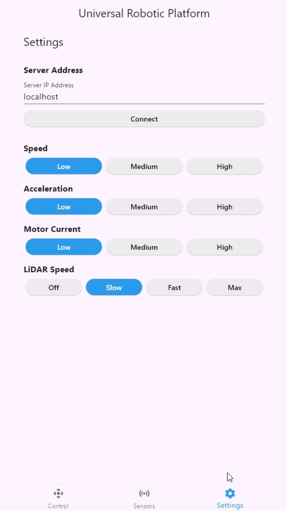

# Robot App

A cross-platform mobile and web application for controlling and monitoring a robot platform in real time.
# Feature

## Features
- **Live Robot Control:** Send commands to the robot for movement and configuration.

    

- **Sensor Visualization:** View real-time data from robot sensors (proximity, ground, IMU, battery voltage, etc.).

     

- **Settings Management:** Configure robot parameters such as speed, acceleration, and LiDAR config from the app.

    

- **Multi-Platform Support:** Runs on Android, iOS, Windows, and Web.

## Technologies Used
- **Flutter & Dart:** Main framework for cross-platform development.
- **Custom Widgets:** Modular and reusable UI components.
- **REST API Communication:** For real-time data exchange with the robot/server.
- **Material Design:** Consistent and attractive UI/UX.

## Server

Requires a running server to communicate with the robot. The server is implemented in Python using Flask and ESP-NOW for communication with the robot hardware. For more details, see the [Robot Server README](../server/).

---
Go back to the main project [README](../) for other details.
